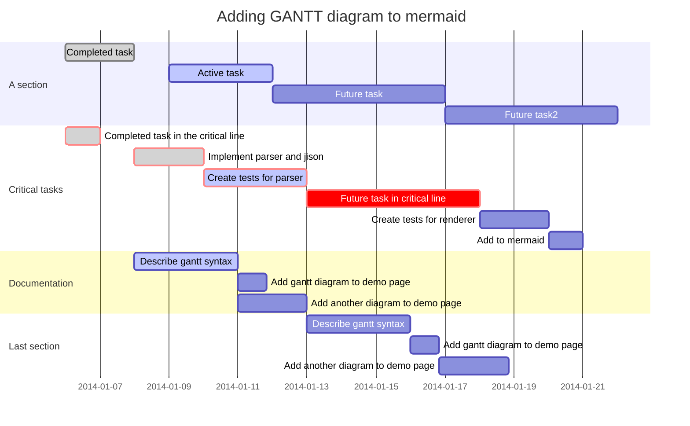

# Encuentro de profesores de computación 2918

## Recursos Didacticos

* [MermaidJS](https://mermaidjs.github.io/). - Libreria Javascript para generación de Diagramas de flujo utilizando Markdown
* [Gravizo]()- API que permite incrustar diagramas en [GraphViz](),[Dot](),[Mermaid]() en editores Markdown en linea, incluyendo Github
* [Markdown Plus](https://mdp.tylingsoft.com/#preferences-modal). Editor Markdown en linea que permite incluir graficos en GraphViz, Miriad y otros formatos
* [flowcharj.js](). Libreria Javascript para la generación de SVG 
* [GitBook](https://www.gitbook.com/). Documentación de proyectos en Markdown.

## Ejemplos

### Gantt diagram

